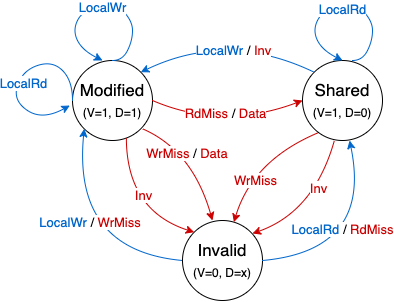
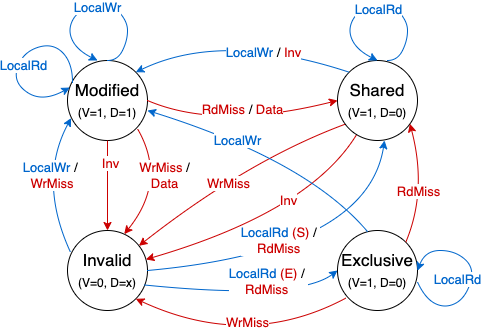

# multicore-cache
Trace-driven simulation for cache coherence protocols
### Snoopy (bus-based) coherence protocols
Blue arrows are transitions driven by local (CPU) input, while red arrows are transitions driven by messages snooped from the bus.  
- MSI [implemented]  
    
- MESI [in progress]  
    
- MOESI
- etc.
- Hierarchical snooping?
### Directory based coherence protocols

### Considerations:
- Need to keep track of data as well (done)
- How to model bus and bus control
    - arbiter
        - one core per clock cycle?
        - smarter arbiter to take requesting core when no other cores are requesting?
- trace file format? line by line wouldn't take into account simultaneous access
    - a separate trace for each core?
    - time, access type, address

- Currently supports byte-sized read and writes. Default value (if not written to before) is 0.
- Deal with bus widths smaller than line size
## Compile and run simulation
```
g++ cache.cc memory.cc system.cc simulator.cc -o simulator
```
```
./simulator <config> <space-delimited list of trace files>
```
List one trace file per core.
## Config file format
```
<number of cores>, <coherence protocol>
<line size>, <cache size>, <associativity>, <hit time>, <miss penalty>
<shared memory size>, <data bus width>
```
All sizes are in bytes.
### Coherence protocols:
- MSI = 0
- MESI = 1
## Trace file format
```
<core num> <access type> <address> <data>
```
### Access type:
- data read = 0
- data write = 1
- instr fetch = 2
### Data:
- Expected value for a read
- Value to be stored for a write